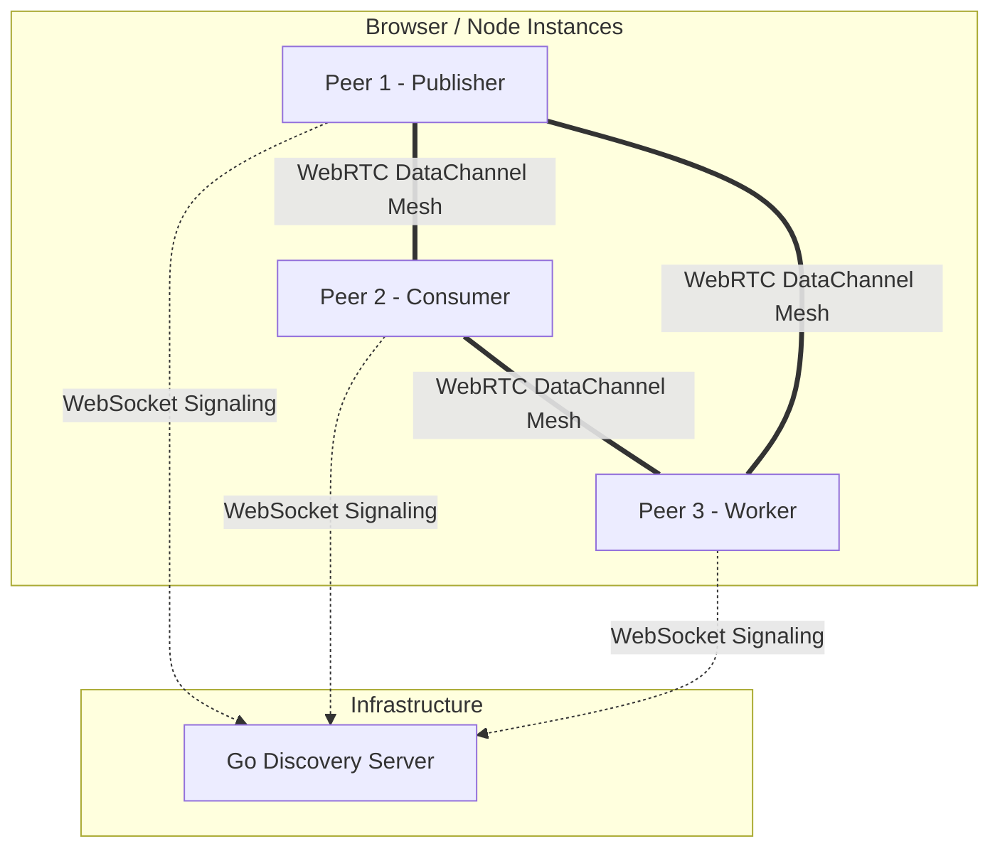

<!--
// Copyright (c) 2024-2026 Soumya Debnath. All Rights Reserved.
// Licensed under the Business Source License 1.1 (BSL 1.1).
// See LICENSE file for details. Production use requires a paid license.
// Contact: soumyadebnath1661@gmail.com | +91 7031648617
-->

<div align="center">
  <h1>ZeroQ</h1>
  <p><b>Serverless P2P Message Queue — Pub/Sub, Work Queues, and RPC over WebRTC</b></p>

  [](https://mariadb.com/bsl11/)
  []()
  []()
  []()
</div>

<hr/>

> **WARNING — npm name collision.** The package name `zeroq` on the npm registry is owned by an unrelated author (`hisco`). Running `npm install zeroq` installs their package, not this one. This is a silent failure — your project will compile against the wrong library. A rename of this project is pending the author's decision. **Do not use `npm install zeroq`.**

---

## Table of Contents

1. [What is ZeroQ?](#what-is-zeroq)
2. [Installation](#installation)
3. [Usage Examples](#usage-examples)
4. [API Reference](#api-reference)
5. [Message Delivery Guarantees](#message-delivery-guarantees)
6. [Architecture Overview](#architecture-overview)
7. [Go Discovery Server](#go-discovery-server)
8. [Known Limitations](#known-limitations)
9. [Comparison with Competitors](#comparison-with-competitors)
10. [FAQ](#faq)
11. [Author & License](#author--license)

---

## What is ZeroQ?

ZeroQ is a serverless, peer-to-peer message broker. By leveraging WebRTC DataChannels for mesh routing and IndexedDB for persistent storage, ZeroQ creates a decentralised queue directly in the browser or Node.js. A lightweight Go discovery server handles WebRTC signaling — actual message payloads flow directly between peers.

### Key Features

- **Zero Infrastructure:** No dedicated broker servers required for message routing.
- **P2P Mesh Network:** Direct peer-to-peer message routing via WebRTC DataChannels.
- **Durable Persistence:** IndexedDB-backed at-least-once delivery (browser only).
- **Versatile Patterns:** Pub/Sub, Work Queues, Request/Reply, Priority Queues, Dead-Letter Queues.
- **Gossip Discovery:** Peer discovery propagates through the mesh via gossip.
- **Auto-Reconnect:** Exponential backoff with jitter on both WebSocket and peer connections.

---

## Installation

This library is **not published to npm**. Use one of these two paths:

### Option A — jsDelivr CDN (browser, no build step)

```html
<script type="module">
  import { ZeroQ } from 'https://cdn.jsdelivr.net/gh/itsoumya-d/zeroq@main/dist/index.mjs';
</script>
```

### Option B — Clone and build

```bash
git clone https://github.com/itsoumya-d/zeroq.git
cd zeroq
npm install
npm run build
# dist/ is now available locally
```

---

## Usage Examples

### Constructor

```typescript
import { ZeroQ } from '...'; // from dist/index.mjs

const zeroq = new ZeroQ({ discoveryUrl: 'wss://discovery.yourdomain.com/ws' });
// discoveryUrl defaults to 'ws://localhost:8080' if omitted
```

### 1. Pub/Sub Messaging

```typescript
// Subscriber
await zeroq.subscribe('news.updates', (msg) => {
  console.log('Received:', msg.payload);
});

// Publisher
await zeroq.createTopic('news.updates');
await zeroq.publish('news.updates', { headline: 'ZeroQ hits pre-release!' });
```

### 2. Work Queues (Load Balancing)

```typescript
// Worker
await zeroq.consume('image-processing', (msg, ack, nack) => {
  try {
    processImage(msg.payload.url);
    ack();
  } catch (err) {
    nack(); // Requeue; moved to DLQ after 3 attempts
  }
});

// Producer
await zeroq.createQueue('image-processing');
await zeroq.enqueue('image-processing', { url: 'https://example.com/img1.jpg' });
```

### 3. Request/Reply (RPC)

```typescript
// Server
await zeroq.reply('rpc.getUser', async (msg) => {
  return { user: await db.getUser(msg.payload.id) };
});

// Client
const response = await zeroq.request('rpc.getUser', { id: 123 }, 5000);
```

### 4. Priority Queues

```typescript
await zeroq.enqueue('alerts', { severity: 'CRITICAL' }, { priority: 1 });
await zeroq.enqueue('alerts', { severity: 'INFO' }, { priority: 10 });
```

---

## API Reference

### `class ZeroQ`

#### `constructor(options?: { discoveryUrl?: string })`
Initialises the ZeroQ client. Note: earlier documentation showed a positional string argument — the actual API takes an options object.

#### `async createTopic(topic: string): Promise<void>`
Registers a pub/sub topic with the discovery server.

#### `async publish(topic: string, message: any): Promise<void>`
Publishes a payload to a topic.

#### `async subscribe(topic: string, handler: (msg: Message) => void): Promise<Subscription>`
Subscribes to a topic. Returns a `Subscription` with `.unsubscribe()`.

#### `async createQueue(queue: string): Promise<void>`
Registers a distributed work queue.

#### `async enqueue(queue: string, message: any, options?: { priority?: number; delay?: number }): Promise<void>`
Adds a message to a work queue.

#### `async consume(queue: string, handler: (msg: Message, ack: () => void, nack: () => void) => void): Promise<Consumer>`
Consumes from a queue. Returns a `Consumer` with `.unsubscribe()`. Call `ack()` on success or `nack()` to retry (max 3 times before dead-letter).

#### `async request(topic: string, message: any, timeoutMs?: number): Promise<any>`
RPC pattern. Rejects with `Timeout` if no reply arrives within `timeoutMs`.

#### `async reply(topic: string, handler: (msg: Message) => any): Promise<void>`
Listens for RPC requests and publishes the returned value back.

#### `disconnect(): void`
Closes the WebSocket and all peer connections.

**Not exported (internal only):** `PersistenceLayer`, `PeerMesh`, `MessageBroker`, `DiscoveryClient`. The subpath `zeroq/persistence` does not exist.

---

## Message Delivery Guarantees

ZeroQ provides **at-least-once** delivery for work queues:

1. `publish`/`enqueue` writes the message to local IndexedDB first (browser only).
2. The message is broadcast to peers over DataChannels.
3. Consumers call `ack()` on success (removes from IndexedDB) or `nack()` to retry.
4. After 3 NACKs, the message stays in IndexedDB as a dead letter.

Pub/Sub messages have no persistence guarantee — if no subscriber is connected when a message is broadcast, it is lost.

---

## Architecture Overview



Message deduplication tracks up to 10,000 message IDs in a sliding LRU window. Peer health is monitored with ping/pong every 10 seconds; peers unseen for 30 seconds are dropped.

---

## Go Discovery Server

The signaling backend handles initial peer introductions and topic registration. It never sees message payloads.

```bash
cd discovery
go mod tidy
go build -o zeroq-discovery
./zeroq-discovery
```

**Endpoints:**
- `GET /ws` — WebSocket signaling upgrade
- `GET /api/topics` — List active topics
- `GET /api/queues` — List active queues

---

## Known Limitations

- **Pre-release status.** Not on npm. No production adopters. API may change.
- **No npm publication.** Running `npm install zeroq` installs an unrelated library. See Installation above.
- **No TURN relay — connections fail behind symmetric or carrier-grade NAT.** The ICE configuration uses a single public STUN server (`stun:stun.l.google.com:19302`). STUN cannot traverse symmetric NAT or many mobile carrier-grade NAT deployments; those peers cannot connect at all. When ICE fails, `pc.oniceconnectionstatechange` fires with state `'failed'` or `'disconnected'`; the peer is removed and exponential-backoff reconnection is scheduled. The `connection_failed` event is emitted after WebSocket reconnects are exhausted (10 attempts), but ICE-level failures (symmetric NAT) are treated identically to a peer disconnecting — callers cannot distinguish "unreachable network" from "peer left". If you need reliable connectivity across arbitrary networks, supply your own TURN server.
- **Dead-letter queue requires IndexedDB** (browser only). In Node.js, `PersistenceLayer.init()` is a no-op and messages are not persisted.
- **`zeroq/persistence` does not exist** as an importable subpath. `PersistenceLayer` is an internal class.
- **No authentication.** Any peer knowing the discovery URL and topic ID can join.
- **WebRTC polyfills needed for Node.js backend use** (`node-datachannel` or `wrtc`, plus `fake-indexeddb`).

---

## Comparison with Competitors

| Feature | ZeroQ | Kafka | AWS SQS | Redis Pub/Sub | NATS |
|---------|-------|-------|---------|---------------|------|
| **Cost** | $0 (infra) | High | Pay-per-req | Medium | Low |
| **Topology** | P2P Mesh | Centralized | Cloud | Centralized | Centralized |
| **Persistence** | IndexedDB (browser) | Disk Log | AWS S3/Disk | In-Memory | Disk/Mem |
| **DLQ Support** | Yes | Manual | Yes | No | Yes |
| **RPC Patterns**| Native | Complex | Complex | Manual | Native |

---

## FAQ

**Q: Does ZeroQ support Node.js?**
A: Yes, with polyfills: `node-datachannel` (or `wrtc`) for WebRTC and `fake-indexeddb` for persistence.

**Q: Are messages stored on the discovery server?**
A: No. The server only routes WebRTC handshakes (SDP/ICE candidates).

---

## Author & License

**Author:** Soumya Debnath  
**Email:** [soumyadebnath1661@gmail.com](mailto:soumyadebnath1661@gmail.com)  
**GitHub:** [github.com/itsoumya-d](https://github.com/itsoumya-d)

---

## License — Business Source License 1.1

> **Source-available, NOT open-source. All production use requires a paid license.**

| Tier | Price | For |
|:-----|:------|:----|
| **Indie** | $299/year | Solo developer, <$100K revenue |
| **Startup** | $1,999/year | Up to 10-25 devs, <$5M revenue |
| **Enterprise** | $9,999/year | Unlimited seats, unlimited revenue |
| **OEM / White-Label** | $19,999/year | Embed in your product |
| **Full IP Buyout** | $750,000 | Complete ownership transfer |

**Free use limited to:** Personal evaluation, academic research, contributing via PRs.

© 2024-2026 Soumya Debnath. All Rights Reserved.
