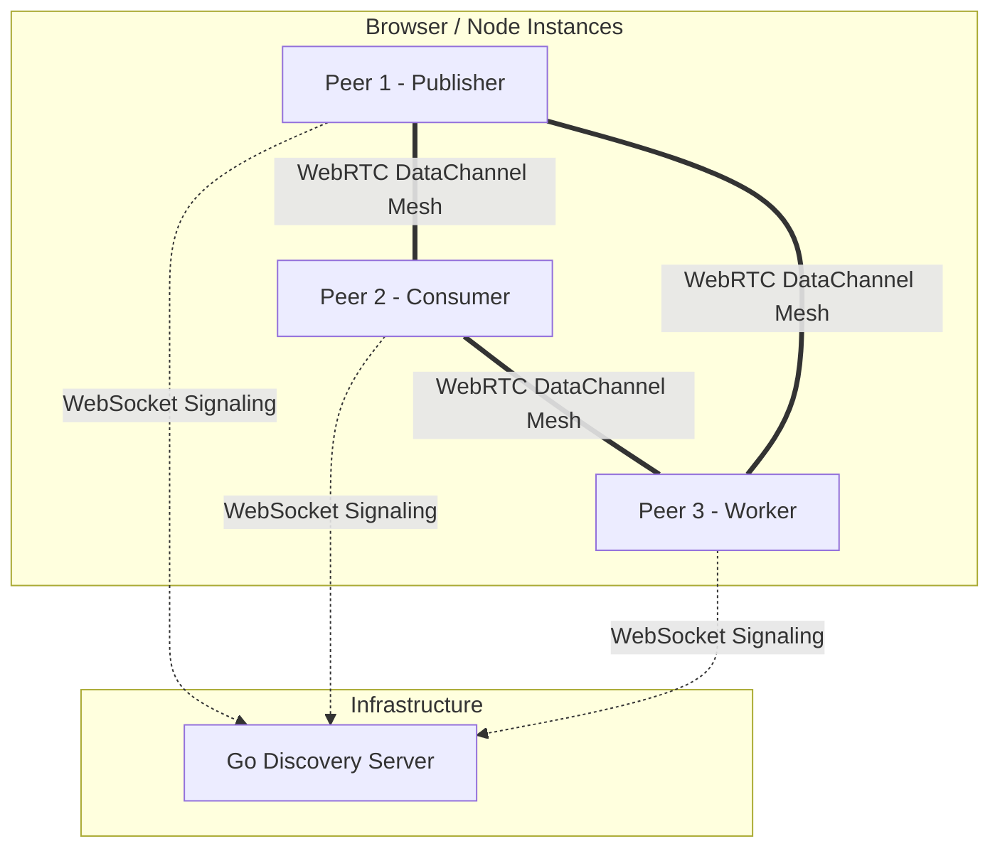

<!--
// Copyright (c) 2024-2026 Soumya Debnath. All Rights Reserved.
// Licensed under the Business Source License 1.1 (BSL 1.1).
// See LICENSE file for details. Production use requires a paid license.
// Contact: soumyadebnath1661@gmail.com
-->

<div align="center">
  <h1>ZeroQ</h1>
  <p><b>ZeroQ moves pub/sub and work-queue messaging directly between browser peers, so small-scale event fan-out does not require operating a broker.</b></p>

  [](https://mariadb.com/bsl11/)
  []()
  []()
  []()
</div>

<hr/>

> **WARNING — npm name collision.** The package name `zeroq` on the npm registry is owned by an unrelated author (`hisco`). Running `npm install zeroq` installs their package, not this one. This is a silent failure — your project will compile against the wrong library. A rename of this project is pending the author's decision. **Do not use `npm install zeroq`.**

---

## Table of Contents

1. [What is ZeroQ?](#what-is-zeroq)
2. [Installation](#installation)
3. [Usage Examples](#usage-examples)
4. [API Reference](#api-reference)
5. [Message Delivery Guarantees](#message-delivery-guarantees)
6. [Architecture Overview](#architecture-overview)
7. [Go Discovery Server](#go-discovery-server)
8. [Known Limitations](#known-limitations)
9. [Comparison with Competitors](#comparison-with-competitors)
10. [FAQ](#faq)
11. [Author & License](#author--license)

---

## What is ZeroQ?

ZeroQ is a serverless, peer-to-peer message broker. By leveraging WebRTC DataChannels for mesh routing and IndexedDB for persistent storage, ZeroQ creates a decentralised queue directly in the browser or Node.js. A lightweight Go discovery server handles WebRTC signaling — actual message payloads flow directly between peers.

### Key Features

- **Zero Infrastructure:** No dedicated broker servers required for message routing.
- **P2P Mesh Network:** Single-hop broadcast over WebRTC DataChannels. Every message goes to every
  directly-connected peer; there is no multi-hop routing and no per-topic mesh partitioning.
- **Local Persistence:** IndexedDB-backed message log (browser only). See
  [Message Delivery Guarantees](#message-delivery-guarantees) for what this does and does not buy you.
- **Patterns:** Pub/Sub, Work Queues, Request/Reply, Dead-Letter inspection.
- **Gossip Discovery:** *Peer ids* propagate through the mesh via gossip (topic metadata does not).
- **Auto-Reconnect:** Exponential backoff with jitter on both WebSocket and peer connections,
  capped at 10 attempts each.

---

## Installation

This library is **not published to npm**. Use one of these two paths:

### Option A — jsDelivr CDN (browser, no build step)

```html
<script type="module">
  import { ZeroQ } from 'https://cdn.jsdelivr.net/gh/itsoumya-d/zeroq@main/dist/index.mjs';
</script>
```

### Option B — Clone and build

```bash
git clone https://github.com/itsoumya-d/zeroq.git
cd zeroq
npm install
npm run build
# dist/ is now available locally
```

---

## Usage Examples

### Constructor

```typescript
import { ZeroQ } from '...'; // from dist/index.mjs

const zeroq = new ZeroQ({ discoveryUrl: 'wss://discovery.yourdomain.com/ws' });
// discoveryUrl defaults to 'ws://localhost:8080' if omitted.
// NOTE: the bundled Go server serves the WebSocket upgrade on /ws only, so the
// default value does not match it — pass an explicit URL ending in /ws.
// topicId (default 'default-topic') is the signaling room; peers must share it.
```

> **A peer never receives its own publishes.** `publish()` broadcasts to connected peers only;
> it does not dispatch to handlers registered on the *same* instance. Publisher and subscriber
> must therefore be **two different peers** (two tabs, two processes, two devices). Every example
> below shows the two sides separately for that reason.

### 1. Pub/Sub Messaging

```typescript
// ---- Peer A (subscriber) ----
const a = new ZeroQ({ discoveryUrl: 'wss://discovery.yourdomain.com/ws' });
await a.subscribe('news.updates', (msg) => {
  console.log('Received:', msg.payload);
});

// ---- Peer B (publisher), a separate browser tab / process ----
const b = new ZeroQ({ discoveryUrl: 'wss://discovery.yourdomain.com/ws' });
await b.createTopic('news.updates');
await b.publish('news.updates', { headline: 'ZeroQ hits pre-release!' });
```

### 2. Work Queues (Load Balancing)

```typescript
// Worker
await zeroq.consume('image-processing', (msg, ack, nack) => {
  try {
    processImage(msg.payload.url);
    ack();
  } catch (err) {
    nack(); // Requeue; moved to DLQ after 3 attempts
  }
});

// Producer
await zeroq.createQueue('image-processing');
await zeroq.enqueue('image-processing', { url: 'https://example.com/img1.jpg' });
```

### 3. Request/Reply (RPC)

```typescript
// Server
await zeroq.reply('rpc.getUser', async (msg) => {
  return { user: await db.getUser(msg.payload.id) };
});

// Client
const response = await zeroq.request('rpc.getUser', { id: 123 }, 5000);
```

### 4. Message Priority (advisory only)

`priority` is carried on the message envelope and is readable by the consumer as `msg.priority`.
**It does not reorder delivery** — there is no priority scheduler; messages are delivered in the
order they arrive on the DataChannel. `delay` is accepted for API compatibility and is ignored.

```typescript
await producer.enqueue('alerts', { severity: 'CRITICAL' }, { priority: 1 });
await producer.enqueue('alerts', { severity: 'INFO' }, { priority: 10 });

await worker.consume('alerts', (msg, ack) => {
  console.log(msg.priority); // 1, then 10 — arrival order, not priority order
  ack();
});
```

---

## API Reference

### `class ZeroQ`

#### `constructor(options?: { discoveryUrl?: string; topicId?: string; licenseKey?: string; allowEval?: boolean })`
Initialises the ZeroQ client. Note: earlier documentation showed a positional string argument — the actual API takes an options object.
`topicId` (default `'default-topic'`) selects the signaling room; peers must share it to discover each other.
Connection setup is asynchronous and is not awaited by the constructor, so sockets open shortly after it returns.

#### `async createTopic(topic: string): Promise<void>`
Registers a pub/sub topic with the discovery server.

#### `async publish(topic: string, message: any): Promise<void>`
Publishes a payload to a topic. Resolves once the frame has been handed to each connected peer's
DataChannel — **not** once anyone has received it. Resolves successfully with zero peers. Rejects only
if the payload is not JSON-serialisable.

#### `async subscribe(topic: string, handler: (msg: Message) => void): Promise<Subscription>`
Subscribes to a topic. Returns a `Subscription` with `.unsubscribe()`.

#### `async createQueue(queue: string): Promise<void>`
Registers a distributed work queue.

#### `async enqueue(queue: string, message: any, options?: { priority?: number; delay?: number }): Promise<void>`
Adds a message to a work queue. `priority` is carried on the envelope as `msg.priority` but does not
reorder delivery. `delay` is accepted and ignored. Otherwise identical to `publish()`.

#### `async consume(queue: string, handler: (msg: Message, ack: () => void, nack: () => void) => void): Promise<Consumer>`
Consumes from a queue. Returns a `Consumer` with `.unsubscribe()`. Call `ack()` on success or `nack()` to retry (max 3 attempts, after which the message remains in local storage as a dead letter).
Consumers on the same peer are served round-robin; consumers on *different* peers each receive every message. See [Message Delivery Guarantees](#message-delivery-guarantees).

#### `async request(topic: string, message: any, timeoutMs?: number): Promise<any>`
RPC pattern. Rejects with `Timeout` if no reply arrives within `timeoutMs`.

#### `async reply(topic: string, handler: (msg: Message) => any): Promise<void>`
Listens for RPC requests and publishes the returned value back.

#### `disconnect(): void`
Closes both WebSockets and all peer connections, and cancels every pending reconnect timer and ping
interval. Idempotent. After `disconnect()` the instance is terminal — reconnection is not attempted and
the instance cannot be reused.

### Mesh events

The internal `PeerMesh` extends a minimal `EventEmitter`. It is not exported, but the events it emits
are: `peer_connected(peerId)`, `peer_disconnected(peerId)`,
`peer_connection_failed(peerId, iceConnectionState)`, `peer_unreachable(peerId, reason)`,
`connection_failed(reason)` (WebSocket reconnects exhausted), `message_dropped(peerId, reason, detail)`
and `message_received(rawFrame)`.

**Not exported (internal only):** `PersistenceLayer`, `PeerMesh`, `MessageBroker`, `DiscoveryClient`. The subpath `zeroq/persistence` does not exist.

---

## Message Delivery Guarantees

**ZeroQ provides best-effort, at-most-once delivery.** It is not an at-least-once queue and it is
not an exactly-once queue. Read this section before designing around it.

What actually happens:

1. `publish`/`enqueue` writes the message to the local IndexedDB store (browser only; a no-op in
   Node without a polyfill), then broadcasts it to every currently-connected peer.
2. Each receiving peer suppresses duplicates (by message id + delivery attempt), persists the
   message, then dispatches it to that peer's handlers.
3. `subscribe` handlers all receive the message. `consume` handlers on a given peer are served
   round-robin, so exactly one consumer *per peer* is invoked.
4. `ack()` deletes the message from the local store. `nack()` increments `retryCount` and
   re-broadcasts, up to 3 attempts.

Known gaps you must design around:

- **No delivery confirmation.** `publish()` resolves as soon as the frame has been handed to the
  DataChannel. It resolves successfully even when there are zero peers, when the channel is
  congested, or when the payload is too large to send — in all three cases the message is dropped.
  Subscribe to the `message_dropped` event on the mesh if you need to observe this.
- **Work queues fan out across peers, they do not load-balance across them.** A message is
  delivered to one consumer *on each peer*, so N peers each running one worker means the job is
  processed N times. Competing-consumer semantics only hold **within a single peer**.
- **No visibility timeout / no redelivery on consumer death.** If a consumer receives a message
  and never calls `ack()` or `nack()` (e.g. the tab closes), nothing redelivers it.
- **`nack()` retries reach other peers, not the local consumer pool.** A peer does not receive its
  own broadcasts, so a retry can only be picked up by a *different* peer that also consumes that
  queue.
- **Offline peers miss everything.** There is no log replay, no consumer offsets and no retention
  policy. A peer that is not connected when a message is broadcast never receives it, and the
  IndexedDB store grows without bound until the browser's storage quota is hit.
- **Dead letters are stored but there is no public API to read them.** `PersistenceLayer.getDeadLetterQueue()`
  filters the store for `retryCount >= 3`, but `PersistenceLayer` is internal and `ZeroQ` exposes no
  accessor. Dead letters are currently only reachable by opening the `zeroq-db` IndexedDB database
  directly.

Pub/Sub messages have no persistence guarantee — if no subscriber is connected when a message is
broadcast, it is lost.

### Throughput

Measured on a single machine with an in-process loopback DataChannel (no network, no DTLS/SCTP),
which is a strict upper bound:

| Configuration | publish() rate | end-to-end delivered |
|---|---|---|
| With IndexedDB persistence | ~480 /s | ~480 /s |
| Persistence disabled (no IndexedDB) | ~100,000 /s | ~61,000 /s |

`publish()` awaits one IndexedDB transaction per message with no batching, so enabling the
documented durability path costs roughly two orders of magnitude of throughput. Reproduce with a
loop of `publish()` calls against a subscriber on a second instance.

---

## Architecture Overview



Message deduplication tracks up to 10,000 message IDs in a sliding LRU window. Peer health is monitored with ping/pong every 10 seconds; peers unseen for 30 seconds are dropped.

---

## Go Discovery Server

```bash
cd discovery
go mod tidy
go build -o zeroq-discovery
./zeroq-discovery
```

**Endpoints:**
- `GET /ws` — WebSocket signaling upgrade
- `GET /api/topics` — List active topics
- `GET /api/queues` — List active queues

> **⚠️ The bundled server does not relay signaling yet.** `discovery/handler.go` reads each client
> frame and records `topic`/`queue` names for the two `/api/*` endpoints, but nothing is ever written
> to a client's `send` channel: there is no `peer_joined` notification and no forwarding of `offer`,
> `answer` or `ice_candidate` between clients. Because `PeerMesh.connectToPeer()` is only reached
> from a `peer_joined` message, **no WebRTC peer connection is ever established against this server**,
> on any network. You must supply a signaling server that implements the client protocol below.
>
> Client → server: `{type:'join', topicId}`, `{type:'offer'|'answer', peerId, sdp}`,
> `{type:'ice_candidate', peerId, candidate}`, plus the bookkeeping messages
> `{type:'create_topic'|'subscribe', topic}` and `{type:'create_queue'|'consume', queue}`.
>
> Server → client (all currently missing): `{type:'peer_joined', peerId}` for each other member of
> the same `topicId`, and `offer`/`answer`/`ice_candidate` forwarded to the addressed `peerId` with
> `peerId` rewritten to the sender's id.
>
> Note also that `CheckOrigin` returns `true` unconditionally and there is no authentication, so any
> origin can join any room, and the `topics`/`queues` maps grow without bound from untrusted input.

---

## Known Limitations

- **Pre-release status.** Not on npm. No production adopters. API may change.
- **No npm publication.** Running `npm install zeroq` installs an unrelated library. See Installation above.
- **The bundled Go discovery server does not relay signaling,** so no peer connection is ever
  established against it. See [Go Discovery Server](#go-discovery-server) for the protocol you must
  implement. This is the single largest blocker to using ZeroQ today.
- **No TURN relay — connections fail behind symmetric or carrier-grade NAT.** The ICE configuration is
  hardcoded to a single public STUN server (`stun:stun.l.google.com:19302`). STUN cannot traverse
  symmetric NAT or many mobile carrier-grade NAT deployments; those peers cannot connect at all.
  **There is currently no constructor option to supply your own `iceServers`/TURN credentials** — you
  must edit `src/peer-mesh.ts` and rebuild. `iceTransportPolicy` and `iceCandidatePoolSize` are not
  set either.
- **ICE failures are reported, but coarsely.** On `'failed'`/`'disconnected'` the mesh emits
  `peer_connection_failed(peerId, iceConnectionState)` followed by `peer_disconnected(peerId)`, and
  `peer_unreachable(peerId, reason)` once the 10-attempt reconnect budget is spent. There is no
  aggregate "the whole mesh is unreachable" signal.
- **Dead-letter queue requires IndexedDB** (browser only) **and has no public accessor.** In Node.js,
  `PersistenceLayer.init()` is a no-op and messages are not persisted.
- **`zeroq/persistence` does not exist** as an importable subpath. `PersistenceLayer` is an internal class.
- **No authentication and no encryption above DTLS.** Any peer knowing the discovery URL and topic ID
  can join, read every message on every topic (the signaling room is one flat namespace), and publish
  as anyone. A peer can also permanently suppress a message by claiming its id first, since duplicate
  suppression trusts the sender-supplied `id`.
- **Topic and queue names share one namespace.** A single `enqueue()` fires both `subscribe` handlers
  and `consume` handlers registered under the same name.
- **No message chunking.** WebRTC DataChannels cap a single message at `sctp.maxMessageSize`
  (spec minimum 64 KiB; 256 KiB in Chrome). Larger payloads fail inside `broadcast()` and are dropped
  with a `message_dropped` event; `publish()` still resolves successfully.
- **`Message.seq` is always 0** and is never read. There is no sequencing or reordering logic; ordering
  relies entirely on the ordered delivery of a single DataChannel.
- **WebRTC polyfills needed for Node.js backend use** (`node-datachannel` or `wrtc`, plus `fake-indexeddb`).
  Note that Node ≥ 22 provides a global `WebSocket`, so a ZeroQ instance opens real signaling sockets in
  Node even without polyfills.

---

## Comparison with Competitors

| Feature | ZeroQ | Kafka | AWS SQS | Redis Pub/Sub | NATS |
|---------|-------|-------|---------|---------------|------|
| **Infra cost** | $0 for routing (a signaling server is still required) | High | Pay-per-req | Medium | Low |
| **Licence cost** | $299–$9,999/yr for any production use (BSL 1.1) | Apache-2.0 | usage-based | BSD | Apache-2.0 |
| **Topology** | P2P broadcast, single hop | Centralized | Cloud | Centralized | Centralized |
| **Delivery** | **at-most-once, best-effort** | at-least-once / exactly-once | at-least-once | at-most-once | at-most-once / at-least-once (JetStream) |
| **Persistence** | IndexedDB, browser only, no retention | Disk log | AWS-managed | In-memory | Disk/Mem |
| **Ordered** | per DataChannel only | per partition | per group (FIFO queues) | per connection | per subject |
| **Replay / offsets** | No | Yes | No | No | Yes (JetStream) |
| **DLQ Support** | Stored, but no public accessor | Manual | Yes | No | Yes |
| **RPC Patterns** | Native | Complex | Complex | Manual | Native |

ZeroQ is not a drop-in replacement for any of these. It targets browser-to-browser fan-out where
running a broker is not worth it and message loss is acceptable.

---

## FAQ

**Q: Does ZeroQ support Node.js?**
A: Yes, with polyfills: `node-datachannel` (or `wrtc`) for WebRTC and `fake-indexeddb` for persistence.

**Q: Are messages stored on the discovery server?**
A: No. The server only routes WebRTC handshakes (SDP/ICE candidates).

---

## Author & License

**Author:** Soumya Debnath  
**Email:** [soumyadebnath1661@gmail.com](mailto:soumyadebnath1661@gmail.com)  
**GitHub:** [github.com/itsoumya-d](https://github.com/itsoumya-d)

---

## License — Business Source License 1.1

> **Source-available, NOT open-source. All production use requires a paid license.**

| Tier | Price | For |
|:-----|:------|:----|
| **Indie** | $299/year | Solo developer, <$100K revenue |
| **Startup** | $1,999/year | Up to 10-25 devs, <$5M revenue |
| **Enterprise** | $9,999/year | Unlimited seats, unlimited revenue |
| **OEM / White-Label** | $19,999/year | Embed in your product |
| **Full IP Buyout** | $750,000 | Complete ownership transfer |

**Free use limited to:** Personal evaluation, academic research, contributing via PRs.

© 2024-2026 Soumya Debnath. All Rights Reserved.
